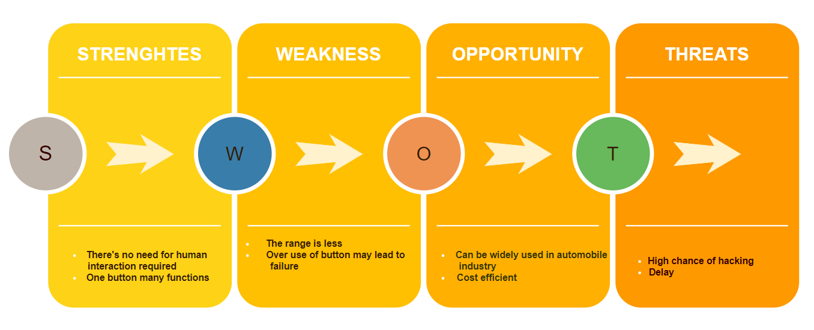
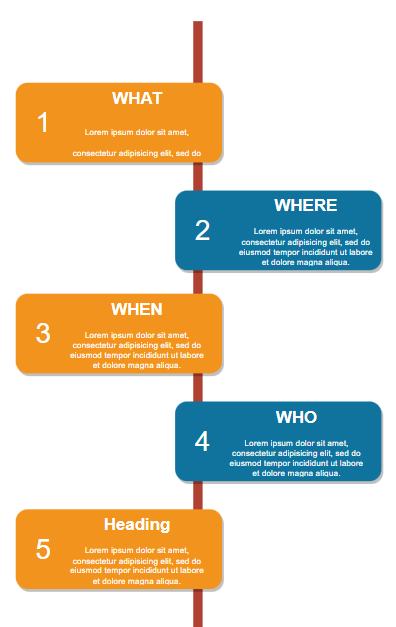

# BICom SYSTEM
## 1_DESCRIPTION
This project is bicom system where it is bidirectional.BiCom functions by bidirectionally transmitting radio waves on a certain frequency, and it also displays the full car state on an LED, allowing us to control all aspects of an automobile.
## 2_Identifying features
When the Button is pressed one time, this should show the car's window status.

When the Button is pressed two times, this should show the car's alarm status.

When the button is pressed three times, this should show cars battery information.

When the Button is pressed FOUR times, this should show the car's door status.

## 3_State of art
Status of the car need to be known when buttons are pressed

Buttons will be provided to make it easier to access the functionalities that are accessible.

## 4_SWOT ANALYSIS

## 5_ 4W's & 1H

## 6_High Level Requirements
|ID|Description|STATUS|
|------|------|------|
|HLR_01|WINDOW STATUS OF THE CAR  | IMPLEMENTED |
|HLR_02|ALARM STATUS OF THE CAR | IMPLEMENTED | 
|HLR_02|BATTERY STATUS OF THE CAR | IMPLEMENTED |
|HLR_03|The DOOR STATUS OF THE CAR | IMPLEMENTED |

## 7_Low Level Requirements
|ID|ID|Description|
|------|------|------|
|HLR_01|LLR_01|When the Button is pressed, all LEDs will turn on|
||LLR_02|When the Button is pressed, all LEDs will turn off |
|HLR_02|LLR_01|All led's need to turn on when the button is pressed |       
||LLR_02|All LED lights shall get turned off at the same time when button pressed|
|HLR_03|LLR_01|System shall print message "Unlock"|              
||LLR_02|All LED lights shall get turned off at the same time|
|HLR_04|LLR_01|LEDs will turn on in a clockwise direction when it is on|              
||LLR_02|LEDs will turn on in a anticlockwise direction when it is off|
|HLR_04|LLR_01|Led lighs when it is on GREEN->ORANGE->RED->BLUE->GREEN|              
||LLR_02| Led lighs when it is off GREEN<-ORANGE<-RED<-BLUE<-GREEN|
